# MGM Laboratory

Monorepo for the MGM Laboratory company site: a Next.js marketing site (`apps/web`) and a NestJS API (`apps/api`), deployed on Railway.

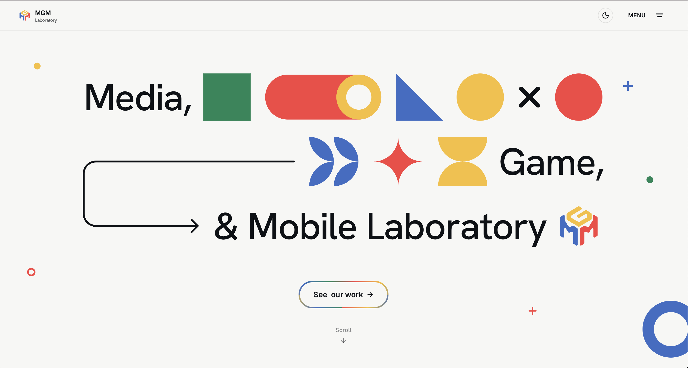
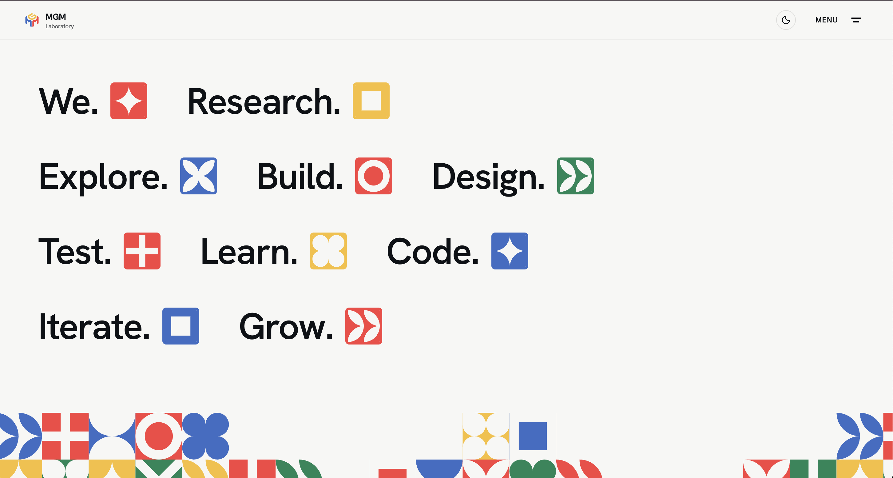
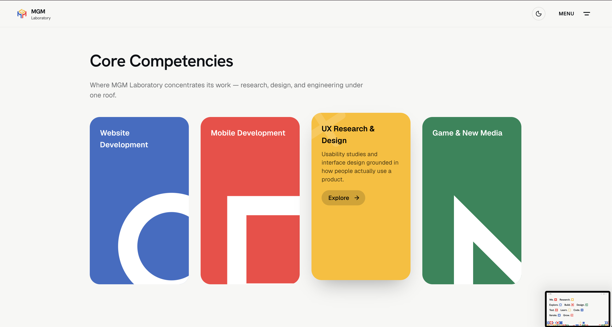
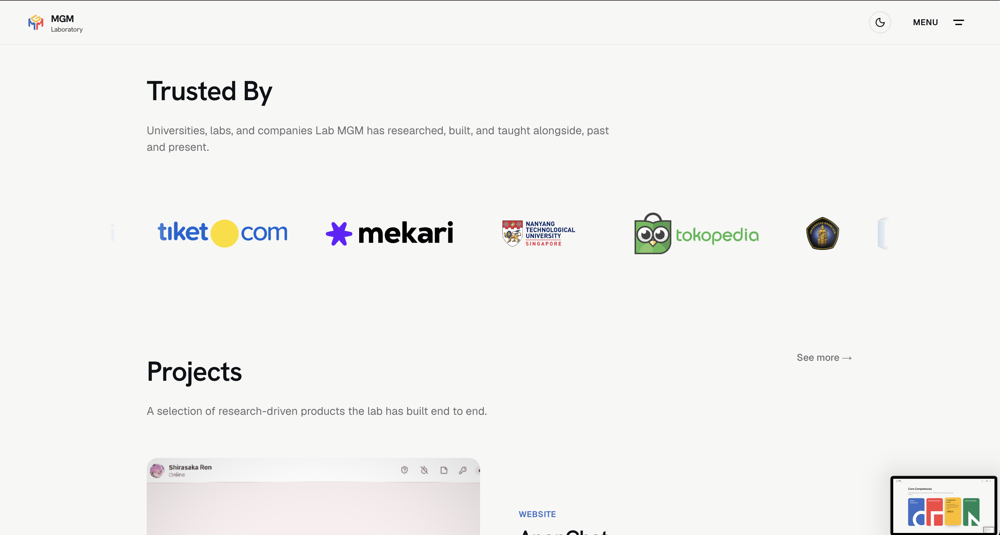
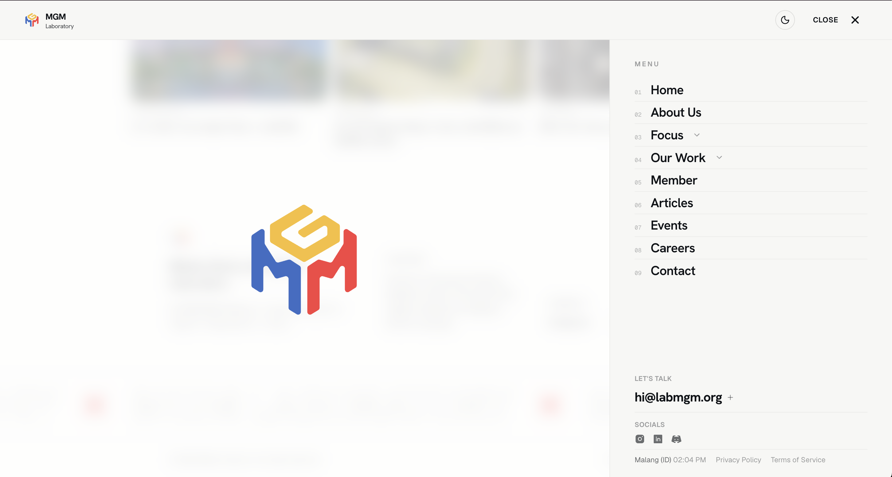
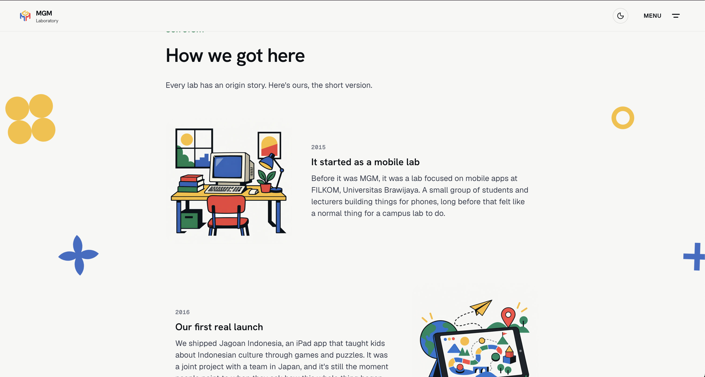
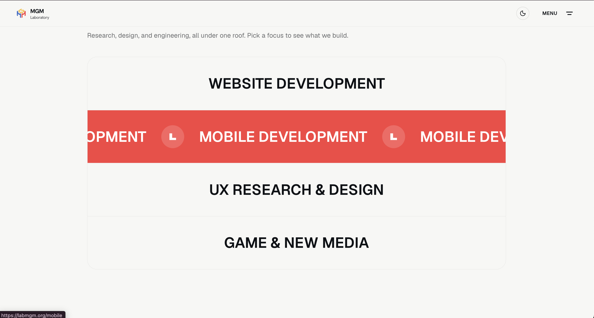
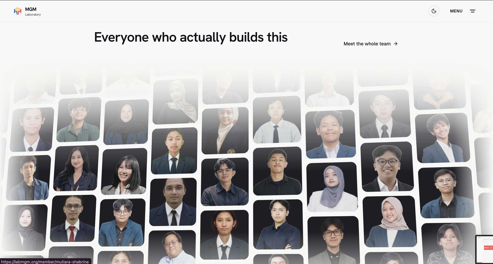
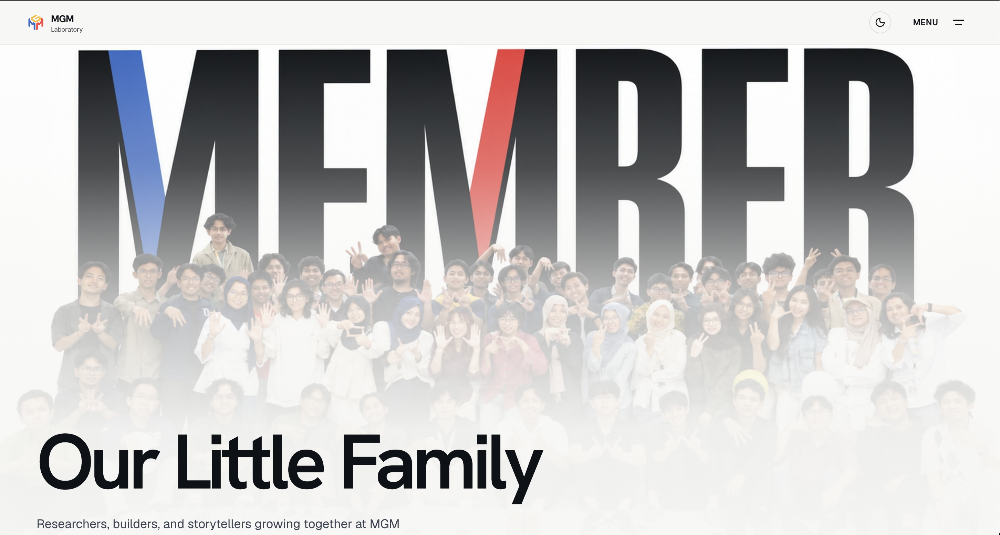
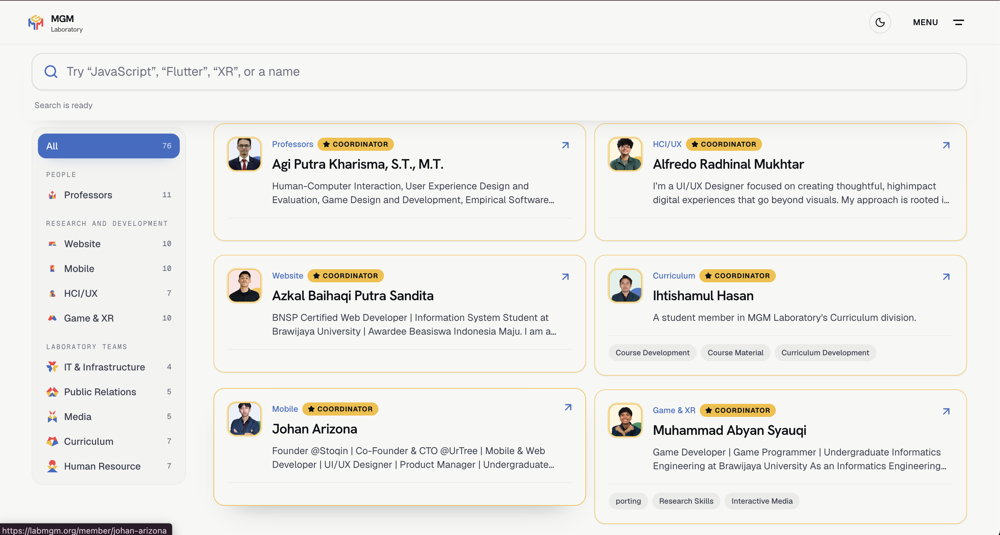
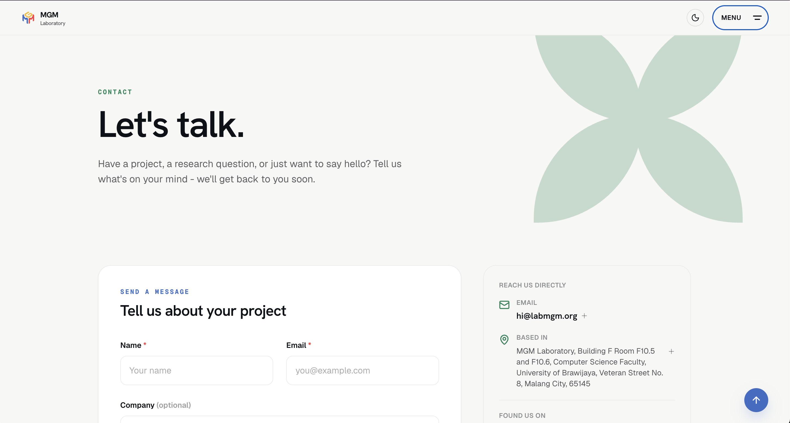

## Docs

Start with [`docs/project-overview.md`](docs/project-overview.md), then [`docs/architecture.md`](docs/architecture.md). The full index is in [`CLAUDE.md`](CLAUDE.md).

## Contributing

See [`CONTRIBUTING.md`](CONTRIBUTING.md) for the PR workflow, local setup, and what the required checks are. Security issues go to [`SECURITY.md`](SECURITY.md) instead of a public issue.
